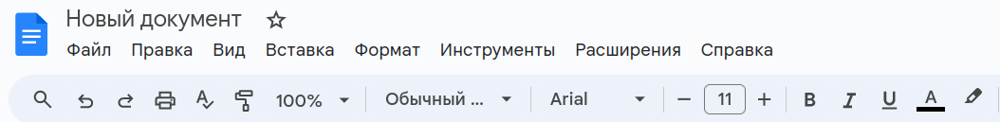
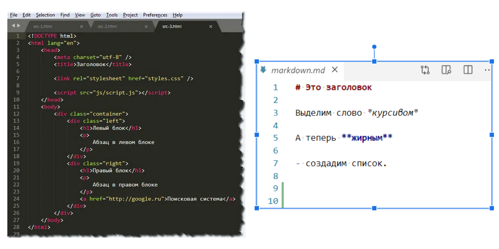
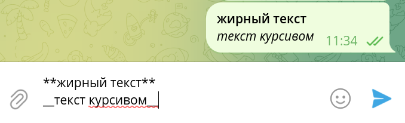
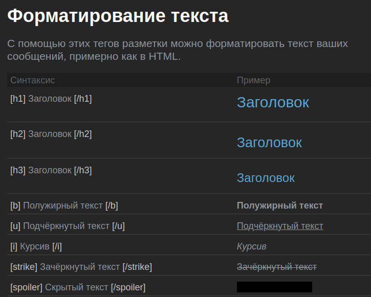
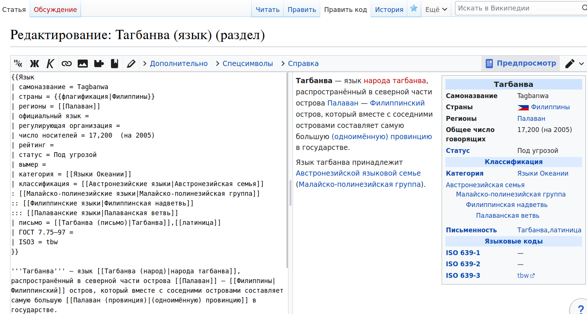

## Введение

Каждый когда-либо создавал текстовый документ в Wordе и оформлял его в соответствии с требованиями (заголовки, выделение абзацев, определенный шрифт и размер шрифта и т.д.). У таких текстовых документах встроены функции оформления.

Или статья, которую вы сейчас читаете, как и любая страница в Интернете, также отформатирована. Здесь уже нужны специальные языки разметки. 

О них, а конкретно о легковесных или облегченных языках разметки, и пойдет сегодня речь.

## Языки разметки

**Языки разметки** — это система специальных символов, которая позволяет создавать структуру и внешнее оформление текста. Таким образом, можно выделить две направляющие разметки: 

   - **функциональная** — задающая структуру текста (абзацы, нумерованные списки, вложенные списки, заголовки и т.д.)
   - **визуальная** — задающая визуальное оформление текста (шрифты, размеры, цвет и т.д.)
   
**Легковесные или облегченные языки разметки** отличаются своим более простым синтаксисом, благодаря которому повышается удобство работы и легкость чтения размеченного текста. Однако такие языки обычно менее функциональны, за счёт своей простоты. Они подходят для задач, где оформление текста важно, но второстепенно.

Для сравнения приведены отформатированные фрагменты текста, размеченные в HTML и Markdown. Сразу можно увидеть, какой язык является легковесным. 

## Некоторые легковесные языки разметки, их особенности и применение.

### Markdown

И начнём мы знакомство как раз с Markdown, пример разметки которого представлен выше. 

К преимуществам Markdown можно отнести то, что файлы в этой разметки без потерь преобразуются в другие форматы (например, HTML и PDF), открываются в любом текстовом редакторе и понятны любому человеку даже в виде исходного кода.

Markdown имеет достаточно широкий профиль применения. Так, к примеру Телеграмм (популярный сейчас мессенджер) дает возможность форматировать сообщения, используя теги Markdown, помимо встроенных изменений. Это удобно для форматирования текста сразу, не переключаясь на специальные возможности. 

Также данная статья написана в файле Markdown, который потом преобразуется в HTML и виден как обычная страница в Интернете, хотя оформление намного проще. 

### BBCode

[Этот язык разметки применяется для форматирования сообщений, размещаемых на электронных досках с объявлениями, в блогах, на форумах и т. д.](https://lred.ru/spravochnik/35455-razmetka)

Сейчас форумы менее популярны, чем было раньше, а блоги чаще всего ведутся в Телеграмме, однако всё же остаётся такая возможность форматирования.

Из точно живых и популярных сервисов, которые поддерживают BBCode, можно указать Steam (популярная игровая площадка). С него взяты правила оформления, в которых видно, как устроен BBCode. Он похож на HTML, однако его отличительной чертой являются квадратные скобки для тегов.

### Wiki-разметка

Кто не пользовался Википедией в своей жизни? Википедия позволяет редактировать статьи и создавать собственные любому пользователю. Для этого используется Вики-разметка, которая позволяет форматировать текст более доступным образом, чем используя HTML. 

Для того, чтобы отредактировать статью, нужно нажать в верхнем правом углу "править код", тогда откроется окно для редактирования.

## Заключение

Данный пост был посвящен легковесным языкам разметки. Были расмотрены некоторые из них, указаны их особенности и применение. Легковесные языки разметки позволяют упростить жизнь и получить приемлемый результат за более короткие сроки и при меньших усилиях, если нужно оформить текст в соответствии определенным критериям.

