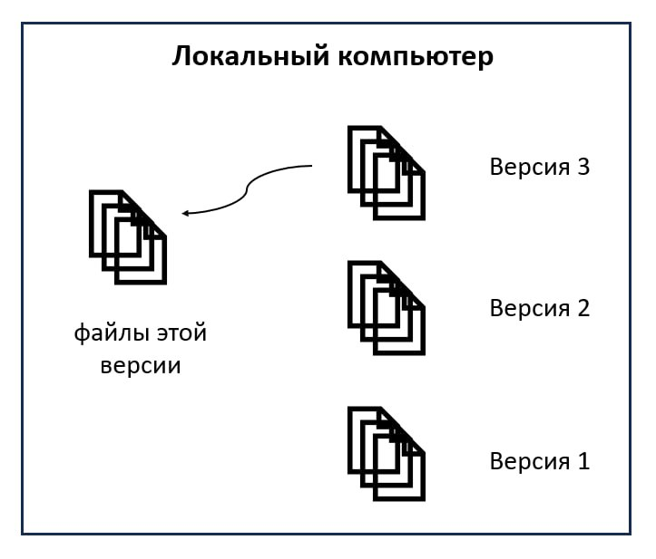
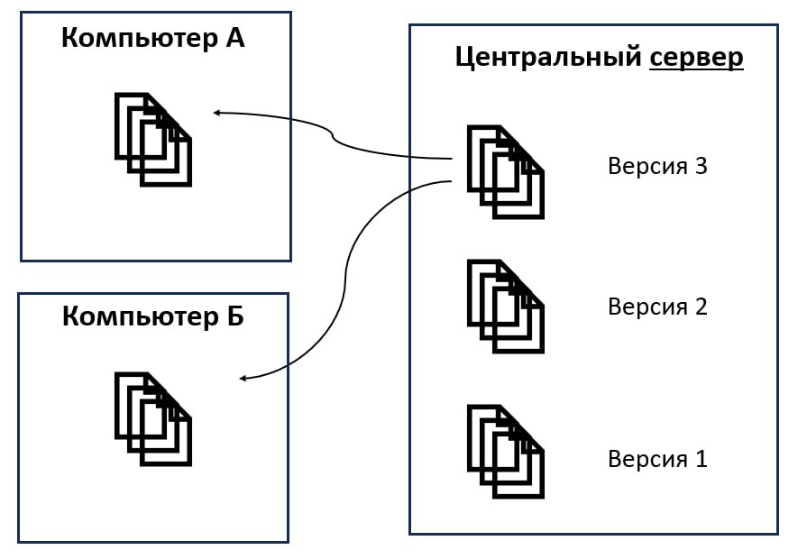
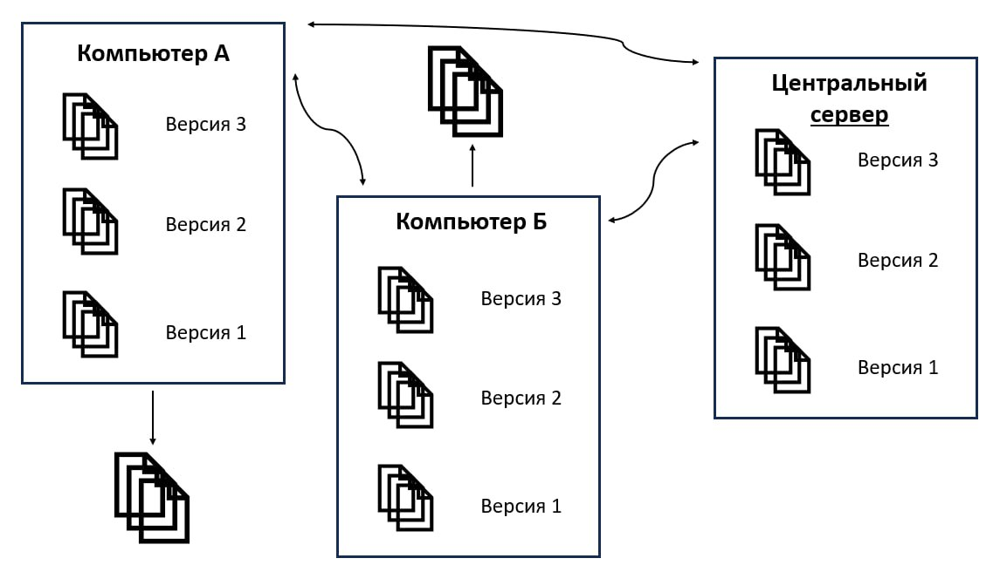

## Система контроля версий

[Система контроля версий (CVS) — это система, записывающая изменения в файл или набор файлов в течение времени и позволяющая вернуться позже к определённой версии. ](https://git-scm.com/book/ru/v2/%D0%92%D0%B2%D0%B5%D0%B4%D0%B5%D0%BD%D0%B8%D0%B5-%D0%9E-%D1%81%D0%B8%D1%81%D1%82%D0%B5%D0%BC%D0%B5-%D0%BA%D0%BE%D0%BD%D1%82%D1%80%D0%BE%D0%BB%D1%8F-%D0%B2%D0%B5%D1%80%D1%81%D0%B8%D0%B9)

Работая над многоэтапной задачей, к примеру над созданием приложения, удобно сохранять различные версии и возвращаться, видя изменения, к каждой сохраненной версии, если это потребуется. Допустим, программист реализовал часть кода определенным образом, а потом решил, что нужно это сделать по-другому. Благодаря системе контроля версий, он может вернуться к моменту, когда программа не содержала внесенные им изменения, и попробовать другое решение. 

Без систем контроля версий также можно организовать себе папки, где вести новые наработки и возвращаться к нужной папке с более старой версией. Однако это менее удобно и в такой организации легко запутаться.

Историю развития систем контроля версий можно представить, рассмотрев виды систем, так как они появлялись поэтапно, исправляя неудобство предыдущего формата.

## Локальные системы контроля версий

Локальные системы контроля версий представляют собой базу данных, находящуюся на локальном компьютере и хранящую файлы различных версий работы над проектом. Пользователь может также выбрать версию, с которой хочет продолжить редактирование и сохранить изменения в новой версии. 

Локальные CVS при своем создании отлично упрощали работу над изменяемой информацией, однако такой подход делает невозможным работу в команде, поэтому как следующий этап развития систем контроля версий появились централизованные CVS.

## Централизованные системы контроля версий

Централизованные системы контроля версий имеют центральный сервер, на котором расположены все версии рабочего проекта. К нему имеют доступ все участники проекта, поэтому каждый может выгружать себе **файлы** версии и работать с ними. Недостаток этой системы заключался в том, что при неполадках с центральным сервером теряется информация о проекте, так как пользователи не связаны друг с другом и скачивают себе только файлы, а не весь репозиторий. Этот недостаток отсутствует в распределенных CVS.

## Распределенные системы контроля версий

Как уже было сказано выше и как представлено на схеме, в распределенных системах контроля версий участники проекта копируют не отдельные файлы, а весь репозиторий. Это позволяет при потере других копий восстановить всю информацию, благодаря одной сохраненной копии. Также пользователи могут видеть репозиторий другого участника, это может быть удобным, если изменения ещё не в главной ветке проекта, а уже необходимы какие-то части кода из разработки. 

## Система контроля версий git.

Система контроля версий git является распределенной CVS. На данный момент она является самой популярной системой контроля версий.

(https://survey.stackoverflow.co/2018#work-_-version-control)

[Git — это программа, которую нужно установить и подключить к проекту для управления системой контроля версий.](https://skillbox.ru/media/code/chto_takoe_git_obyasnyaem_na_skhemakh/) Git, в общем-то, не связан напрямую с Github, Github — это онлайн-хранилище историй версий проектов. Вместо Github можно использовать любое другое хранилище. 

Git отличается от других систем контроля версий способ хранения данных и изменений. В других CVS информация хранится в виде списков изменений, в то время как в git хранятся ссылки на каждый выполненный коммит, если какой-то файл не подвергся изменениям, то git не перезаписывает его снова, как это сделали бы другие системы, а указывает ссылку на последний такой же снимок. 

Представить отличия можно на следующих схемах.

Система хранения информации git:

Система хранения информации других систем контроля версий:

Ещё одна особенность git заключается в том, что с её помощью большинство действий можно выполнять локально без доступа к сети. Также можно сохранить изменения в свой локальный репозиторий и, уже когда будет интернет, отправить изменения в удаленный репозиторий. Во многих других системах контроля версий большинство операций можно выполнять только при подключении к общему серверу.

Также git хранит **все** изменения и невозможно что-то изменить или повредить, чтобы git не заметила. Это достигается благодаря вычислению хеш-суммы перед сохранением. Это удобно тем, что можно не переживать за сохранность данных и совершать эскперименты в изменениях.

Важной для работы информацией о git является знание о трёх основных состояниях, в которых могут находиться файлы:

1. Изменённые файлы — файлы, которые поменяли своё содержание, но ещё не были сохранены.
2. Индексированные файлы — следующее возможное состояние, когда информация изменена и добавлена в следующий коммит.
3. Зафиксированные файлы — файлы, которые уже сохранены в локальном репозитории.

Каждому состоянию соответствует своя секция проекта: рабочая копия (working tree), область индексирования (staging area) и каталог Git (Git directory).

## Заключение

Данный пост был посвящен системам контроля версий. Мы поговорили о том, чем CVS являются и о видах систем контроля версицй. Также подробно разобрали одну из распределенных, самую популярную, систему контроля версий — git. 

Системы контроля версий позволяют убоднее организовывать работу над большими проектами, налаживают взаимодействие участников проекта и позволяют сохранять все изменения, производимые в проектах.

