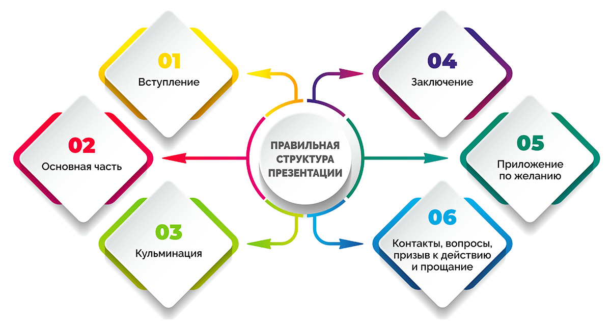
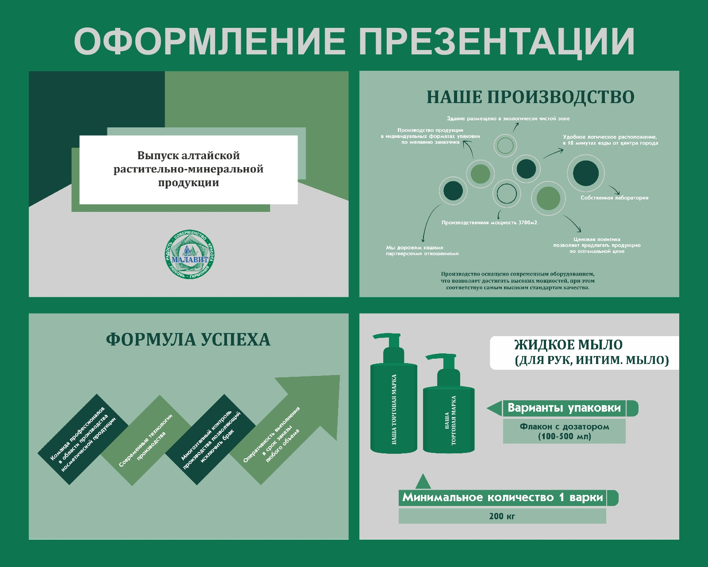

## Перед созданием презентации

[Презентация — это документ или комплект документов, предназначенный для представления чего-либо. Цель презентации — донести до аудитории полноценную информацию об объекте презентации в удобной форме.](https://ru.wikipedia.org/wiki/%D0%9F%D1%80%D0%B5%D0%B7%D0%B5%D0%BD%D1%82%D0%B0%D1%86%D0%B8%D1%8F_(%D1%81%D0%BF%D0%BE%D1%81%D0%BE%D0%B1_%D0%BF%D1%80%D0%B5%D0%B4%D1%81%D1%82%D0%B0%D0%B2%D0%BB%D0%B5%D0%BD%D0%B8%D1%8F_%D0%B8%D0%BD%D1%84%D0%BE%D1%80%D0%BC%D0%B0%D1%86%D0%B8%D0%B8))

Исходя из этого, нужно понимать, что первоначально необходимо *подготовить* информацию, которая потом будет преобразована в формат презентации. Для этого нужно изучить источники и создать текст, на основе которого будет сделана презентация.

Перед тем, как приступать к собственно созданию презентации, нужно убедиться, что вся информация предельно ясна и продумать структуру. 

## Структура презентации

У любой презентации должна быть структура, иначе выступление получится скомканным. Помимо содержательной части, необходим титульный слайд, на котором будет обозначена тема, а также желательно иметь слайд с информацией о докладчике. 

Содержательная часть должна строиться по принципу, представленному на изображении. Почему мы сократили количество текста и не описали структуру словесно? Переходим к следующему пункту.

## Самый важный принцип создания презентаций 

**Если можно представить информацию в виде изображения, то следует выбрать этот способ.**

Так как презентация вспомогательный инструмент для выступления и докладчик рассказывает голосом об информации, на слайды необходимо выносить только то, что может в восприятии и понимании материала. Наиболее ёмкий способ — представить в виде изображения, схемы и т.д. 

## Что ещё важно

Не мало важную роль играет оформление презентации. Речь идёт о шрифтах, цвете, хорошем качестве изображений, схем, диаграмм, таблиц, выравнивании всех элементов презентации. Это позволит слушателю больше погрузиться в тему, привлечь его внимание и доставить визуальное удовольствие. 

## Заключение

В данном посте мы расмотрели основные принципы создания презентаций, особенности, которые позволят преобразовать информацию в удобно воспринимаемый формат, заинтересовать слушателей и создать для себя опору в выступлении.

