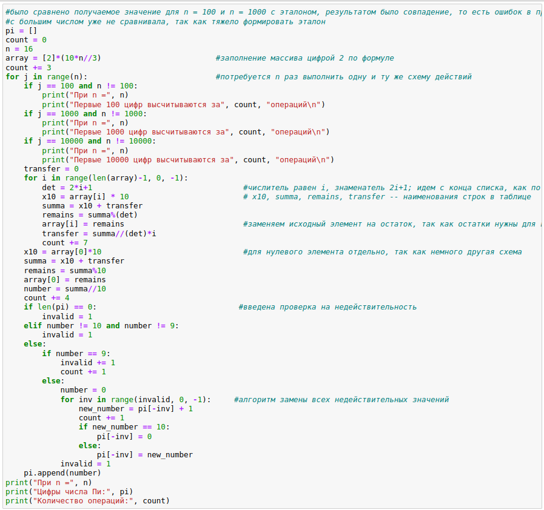
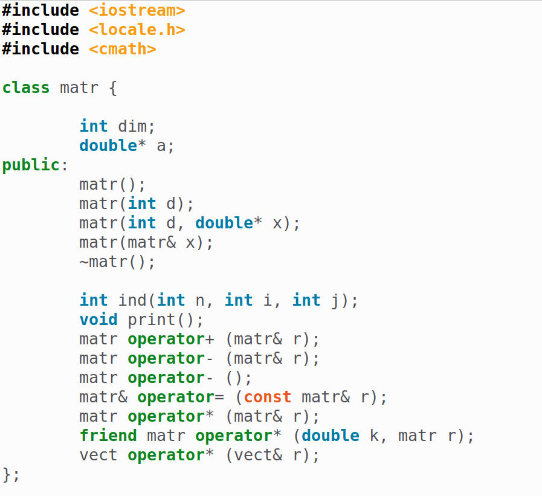
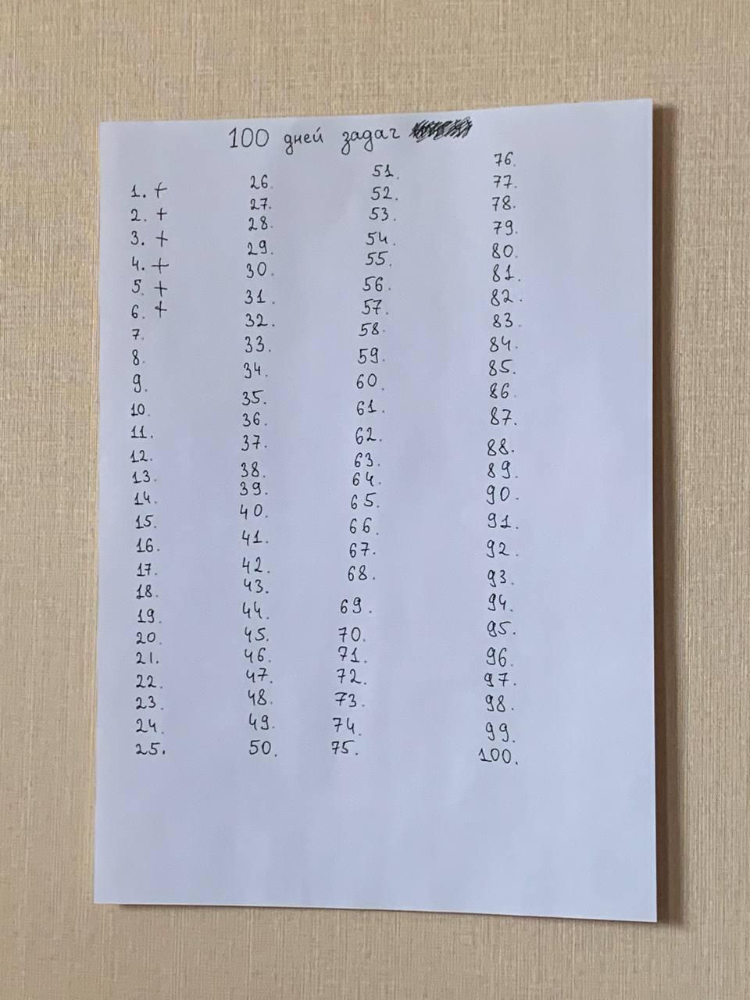

## События недели

На предыдущей неделе в целом было мало что сделано. Она получилась скорее социальная с двумя большими прогулками и празднованием дня рождения подруги. Из-за этого оставалось меньше времени на работу. Также я начала новое хобби и оно меня очень увлекло, поэтому в него также было инвестировано время. 

Но всё же некоторые дела и задания были сделаны. 

**Предмет Компьютерный практикум**

На прошлой неделе был дедлайн выполнения третьей лабораторной работы по Компьютерному практикуму. Необходимо было реализовать алгоритм Spigot для нахождения цифр числа Пи и произвести сравнительный анализ зависимости количества операций от точности вычислений.

Хотя дедлайн был в четверг, я закончила эту работу и написала отчёт во вторник. 

**Предмет Английский** 

Так как я не люблю изучать инстранные языки и они идут у меня с сильным сопротивлением, то достижением на прошедшей неделе было, во-первых, посещение пар по нему, а во-вторых, собственный просмотр видео на английском языке. До этой недели я не слушала ничего самостоятельно.  

**Предмет Архитектура компьютеров: операционные системы**

В понедельник я немного поделала внешний курс, где мне осталось всего несколько уроков. А в субботу утром я сделала лабораторную работу №8. Это немного, но в целом иду по графику. 

**Предмет Технологии программирования** 

Не забывала я и про Технологии программирования. Мы занимались реализацией класса матрицы на C++, необходимо было доделать методы класса, что я успешно и выполнила. 

**Предмет Математический анализ**

На предыдущей неделе в четверг была контрольная по математическому анализу, поэтому первую часть недели я понемного готовилась к ней. Подготовка оправдала усилия, и я получила максимальный балл. 

**Собственные образовательные увлечения**

На прошлой неделе я продолжала заниматься алгоритмами на языке Python и почти каждый день решала несколько алгоритмических задач. В субботу и воскресенье я решила приобрести новые знания и разбиралась в бинарных деревьях и решала задачки с их применением. 

## Основные инсайты 

В целом, как я уже писала, неделя получилась не очень насыщенной на дела и скорее я делала только обязательную часть. Поэтому значительно новых знаний не приобрела. Однако эта неделя показала, что можно совмещать социальную жизнь и учёбу и качество не сильно будет страдать. 

Наверное, больше всего меня впечатлило устройство бинарных деревьев, так как это интересная структура данных, которая позволяет проще осуществлять поиск (если используется дерево поиска), благодаря внутреннему расположению элементов: в каждой левой ветви находится меньшее число, а в правой большее.

## Как удалось применить главные инсайты

Освоенная новая структура данных позволила мне по-новому смотреть на некоторые задачи, видя возможность их решения с помощью бинарных деревьев. 

## Провалы и уроки

Последнее время у меня не очень много энергии на учебу и скорее желание направлено на хобби, друзей, чтение, а также вместо учёбы было несколько моментов прокрастинации. Думаю, я терялась и выбирала более простые занятия, так как хуже планировала предыдущую неделю. Часто у меня возникало чувство, что я не знаю, чем полезным заняться, и бралась за что-то вышеприведенное вместо учебных дел. Эта неделя снова показала мне важность планирования и распределения времени. Я постараюсь учесть это и лучше составлять своё расписание, чтобы знать, когда я выполняю ту или иную работу. 

