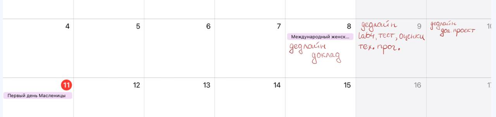
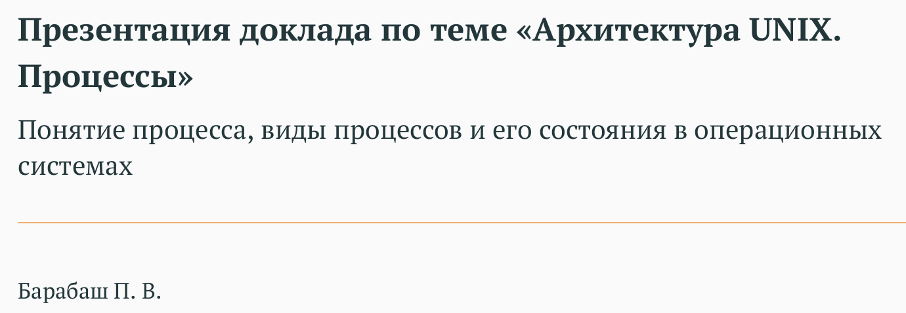
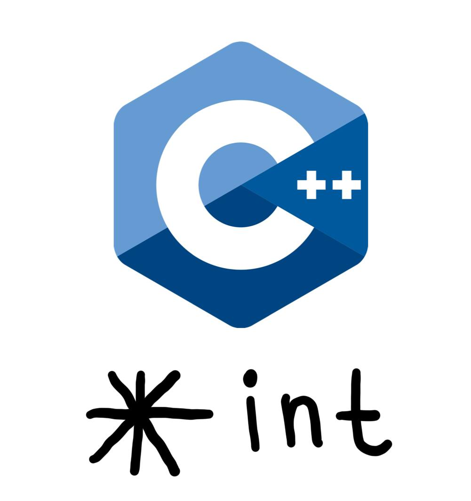

## События недели

На предыдущей неделе было больше выходных, благодаря 8 марта. Также больше было заданий и дедлайнов. Я люблю планировать время и поэтому выписываю себе важные задачи и сроки их выполнения, чтобы разгружать голову и не переживать, что забуду о чём-нибудь.

Эта неделя получилась неоднородной. Самыми продуктивными днями были понедельник, среда и пятница. Во вторник я застряла на одной задаче, потратив на неё много времени, поэтому этот день не кажется мне особо продуктивным. В субботу было очень продуктивное утро, однако уже ко дню я очень устала. В четверг и воскресенье я почти ничего не сделала.

Что же конкретно я сделала на прошедшей неделе?

**Понедельник**

В понедельник у нас была одна дистанционная пара по технологиям программирования, она начиналась в 10:30. 

Последнее время я стараюсь соблюдать режим и ложиться в 22, а иногда от усталости ложусь в 21. Поэтому и просыпаюсь я достаточно рано. Для меня это комфортный режим, так как утром я более продуктивная. 

В понедельник до пары я успела посмотреть первый урок [Тренировок по алгоритмам от Яндекса](https://yandex.ru/yaintern/algorithm-training) и начать делать домашнее задание по ним, состоящее из решения задач по программированию. После пары я также продолжила писать программу. После того, как я удачно справилась с задачей, был перерыв на спортивную активность — силовая тренировка в фитнес-клубе. Спорт помогает мне разгружаться и отдыхать после сидячей работы.

Когда я вернулась, чем я, конечно же, занялась? Опять решала задачки по программированию. Здесь стоит упомянуть, что если я увлекаюсь, а также сразу не могу что-то решить, то буду сидеть до последнего, отдавая задаче много времени и усилий. 

Примерно так, в программировании, и прошел мой день. И хотя по вузу я особо ничего не сделала, но я решила две сложные задачи по программированию, отчего чувствовала себя удовлетворенной. Впереди ещё была целая неделя и я думала, что всё успею.

**Вторник** 

Во вторник утром я снова начала решать задачу от Яндекса, но она никак мне не поддавалась. В итоге я придумала алгоритм, который оказался правильным, но не оптимальным. Раздосадовавшись, а решила переключиться на дела вузовские и поняла, что пора приниматься за подготовку доклада по операционным системам. Как раз поиск информации, создание презентации и отчета заняло у меня весь день, только в 10 утра после тщетных попыток программирования я сходила на растяжку, чтобы отвлечься, и вечером сделала домашнее задание по немецкому.

**Среда**

В среду у меня по расписанию две пары. Однако, проснувшись, я вдруг осознала, что дедлайны близко, а я два свободных дня потратила достаточно впустую. Поэтому мой мозг придумал гениальную идею и убедил меня остаться дома и усиленно работать. 

И я действительно много всего успела и нельзя сказать, что решение было неудачным. Всё утро заняла реализация нужных фукнций в лабораторной работе по технологиям программирования и подготовка отчёта. Мне нужно было разобраться с тем, как работают указатели и ссылки, а также структуры в С++. Я схватываю информацию достаточно легко, но мне нужно и достаточно времени на выполнение каких-то заданий, я достаточно медлительная (или основательная, кто знает). Поэтому отчёт я делала достаточно долго, зато подробным и качественным образом.

Также в этот день я начала выполнять лабораторную работу №4 по операционным системам. По видео-записям получается, что на эту работу мне потребовалось часа два (на само выполнение и выполнение большей части отчета). И снова уделила время подготовке доклада.

Я взяла за привычку заканчивать работать к 19, чтобы сопокойно лечь спать к 22. Среда не была исключением.

**Четверг** 

В четверг я поехала в ВУЗ. После вуза я чувствовала себя не очень хорошо и в целом только оценила лабораторные работы, сделала тест по лекции и поработала над докладом. Спать легла уже в 20:30. 

**Пятница**

Пятница была самым продуктивным днём. Думаю, ключевой причиной стало и достаточное количество сна, физическую нагрузка, и, главное, что я сделала список дел на день и шла по нему поэтапно, долго не останавливаясь на одной задаче.

Итак, в пятницу я закончила отчёт по лабораторной работе №4, сделала презентацию. Подготовила текст выступления доклада и записала видео-презентацию. Подготовила отчёт по лабораторной работе по компьютерному практикуму и загрузила его. Также сделала большой объем обзора на литературу по дополнительному проекту. Почитала учебник по технологиям программирования и дополнительные ресурсы, чтобы разобраться с классами в С++. И дописала немного кода в программу.

Снова легла пораньше.

**Суббота**

В субботу я проснулась в 3:30 и в 3:50 села делать лабораторную работу №5. Сделала её и отчёт по выполнению. Записала видео-презентацию по лабораторной работе №4. Опять работала над обзором литературы по дополнительному проекту. Также я вернулась к выполнению второго этапа индивидуального проекта и написала [статью про системы контроля версий и git](https://pvbarabash.github.io/site/post/getting-started/). Начала смотреть задание по следующей лабораторной работе по компьютерному практикуму. Однако часам к 15 я выдохлась и уже не училась в этот день.

**Воскресенье**

И наконец-то воскресенье. Этот день был выделен на отдых, поэтому днём я только закончила работу с обзором литературы. 

Однако к вечеру у меня появилось желание что-нибудь ещё поделать и я дописала некоторые функции в программу по технологиям программирования и написала код по третьей лабораторной работе по компьютерному практикуму.

На выходных я несколько сбила режим, но ложилась до полуночи.

## Основные инсайты 

В целом все силы на предыдущей неделе были брошены на компьютерную-программистскую составляющую обучения. На задний план ушли математические и языковые предметы.

Основными направлениями обучения были: программирование на языках Python и C++, работа с git, поиск и структурирование информации по понятию процесса и вредоносным запросам (дополнительный проект).

**Программирование:** основным инсайтом было то, что я неплохо умею программировать на Python и всё лучше осваиваю и понимаю C++.  

**Работа с git:** благодаря написанию поста про системы контроля версий и git, я лучше стала понимать, что конкретно мы делаем в лабораторных работах, можно сказать, увидела цельную картину.

**Подготовка доклада:** поняла, что мне нравится визуализировать новоусвоенную информацию в виде схемок, значков и т.д. 

**Обзор литературы:** осознала, что я неплохо справляюсь с анализом работ на английском языке, хотя до этого не было такого опыта.

Больше всего меня впечатлило устройство С++ и git. 

Я достаточно давно программирую на Python, поэтому работа C++ с памятью мне кажется и сложноватой, и интересной, поэтому мне было увлекательно узнать о том, что такое указатели и как их использовать. 

**Указатель в С++** используется, когда требуется дать ссылку на объект. При изменении указателя меняется и сам объект, указатели удобно использовать в функциях и структурах. 

С git мы работали ещё в том семестре, но в этом началось его более углубленное изучение: мы использовали больше функционала. Однако только прицельно почитав про то, как устроен git, я поняла контект того, что мы делаем. 

Подробнее почитать можно в моей статье. Если в двух словах, то меня впечатлила особенность хранения версий в git в сравнении с другими CVS.

## Как удалось применить главные инсайты

Мое понимание темы указателей и работы с памятью в С++ позволило мне написать заданную программу, реализовав собстенную стурктуру. А новые знания про git позволили переосмыслить лабораторные работы, которые мы выполняли по курсу Архитектура компьютеров. 

## Провалы и уроки

Основным провалом было то, что я уделила одним предметам и заданиям время за счёт других. Я несколько отстаю по пониманию от темпа подачи материала математических предметов. Меня не сильно это беспокоит, так как время на усвоение ещё есть до первых контрольных. Но хотелось бы совсем не забрасывать, поэтому на этой неделе я планирую восполнять упущенное. Ещё в более плачевом состоянии находятся языки, так как они совсем не входят в сферу моих интересов и я не хочу уделять им время. Но это именно то, что просто нужно.

В целом у меня получается достаточно продуктивно и много работать, иногда даже чересчур много, что приводит к переутомлениям. Я пока всё ещё ищу баланс, чтобы всё успевать и чувствовать себя хорошо. 
