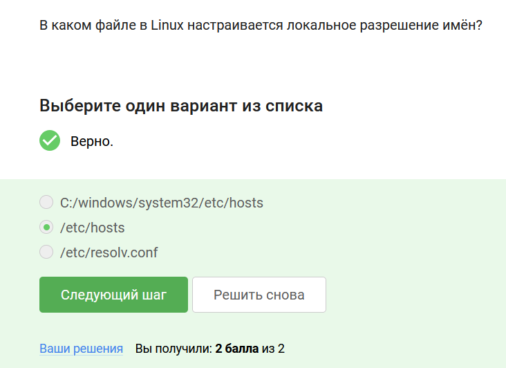
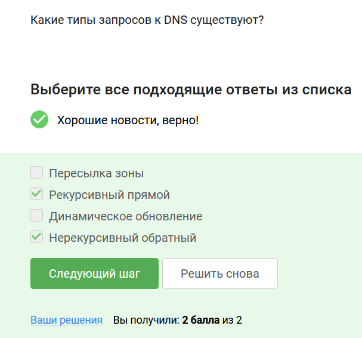
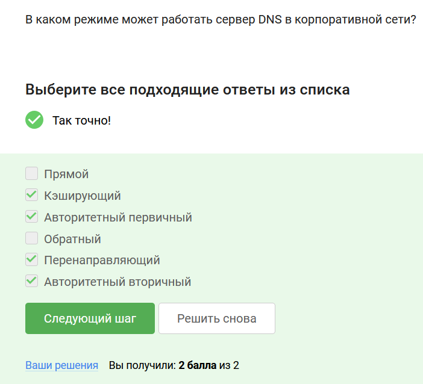
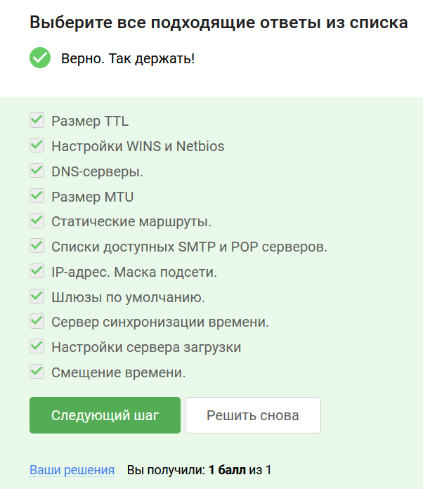
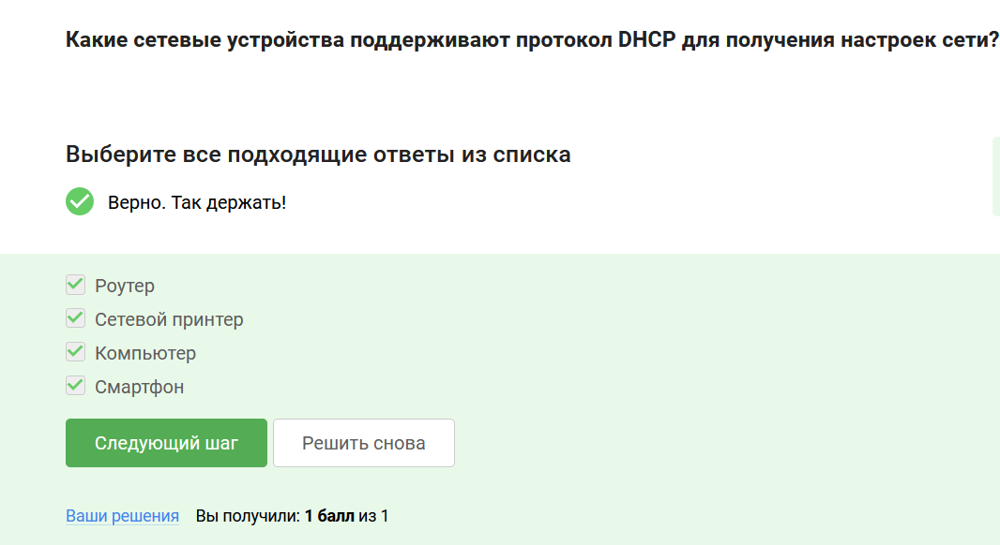

# Выполнение внешнего курса

**Задание 1.** В каком файле в Linux настраивается локальное разрешение имён?

Сразу после установки операционной системы создается файл hosts, местонахождение которого на Linux /etc/hosts.

**Задание 2.** Какие типы запросов к DNS существуют?

Существуют две подгруппы запросов: рекурсивный и нерекурсивный, прямой и обратный.

**Задание 3.** В каком режиме может работать сервер DNS в корпоративной сети?

Существует четыре режима работы: кэширующий, перенаправляющий, авторитетный (первичный — master), авторитетный (вторичный — slave).

**Задание 4.** Какие параметры сетевое устройство получает по DHCP?

Весь перечень параметров представлен в курсе, необходимо было посмотреть, какие из них приведены в задании.

**Задание 5.** Какие сетевые устройства поддерживают протокол DHCP для получения настроек сети?

DHCP (Dynamic Host Configuration Protocol) — это протокол динамической конфигурации сетевых устройств, то есть все сетевые устройства поддерживают этот протокол.

# Выводы 

Я получила знания о DNS и DHCP. 

