# Выполнение внешнего курса

**Задание 1.** По какому протоколу взаимодействует веб-сервер с клиентом?

Основной протокол взаимподействия веб-сервера с клиентом — HTTP (рис. [-@fig:002]).

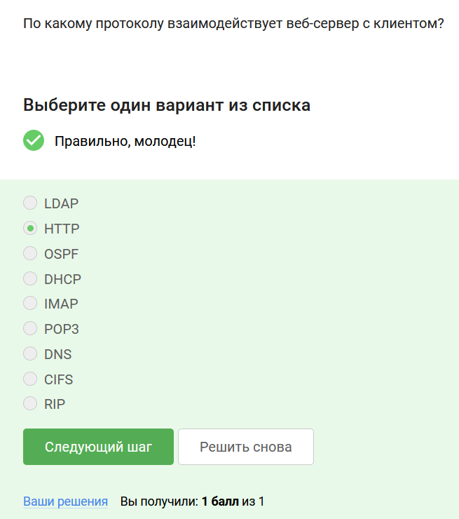{#fig:002 width=70%}

**Задание 2.** Отметьте компоненты двухуровневой и трёхуровневой клиент-серверной архитектуры веб-приложений

В двухуровневой архитектуре взаимодействуют клиент и сервер, в трехуровневой серверов два: сервер приложений и сервер базы данных (рис. [-@fig:003]).

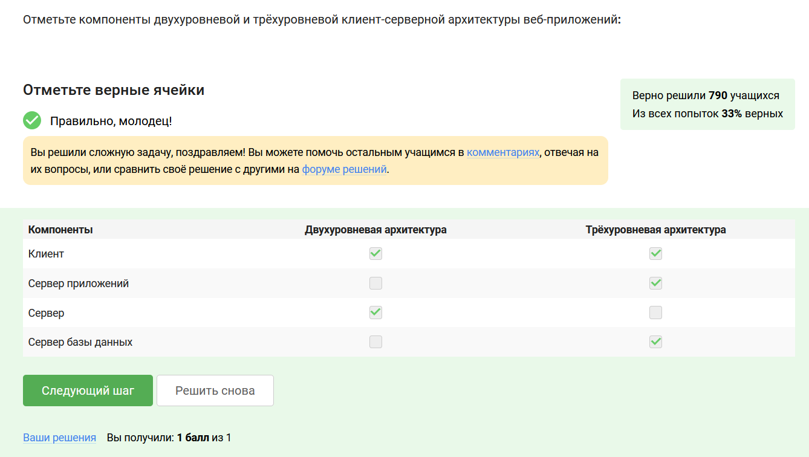{#fig:003 width=70%}

**Задание 3.** Отметьте, какой основой протокол и какие протоколы расширений используются при передаче данных Web-серверов.

Основной протокол — HTTP, остальные протоколы являются расширениями (рис. [-@fig:004]).

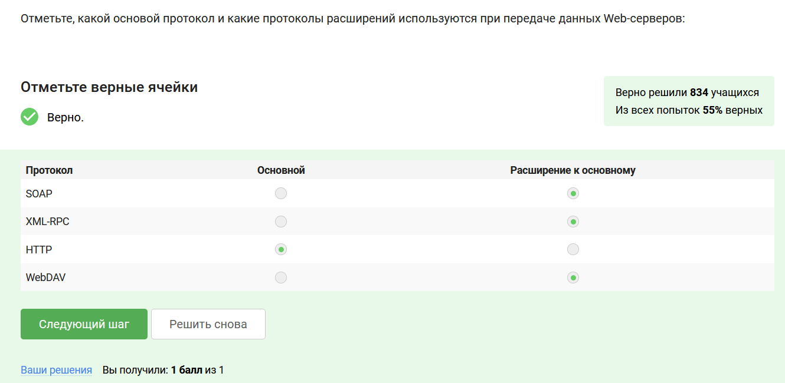{#fig:004 width=70%}

**Задание 4.** Сопоставьте правильные определения у протоколов.

Информация мной взяла из курса, там подробно описано для чего нужен каждый протокол (рис. [-@fig:005]).

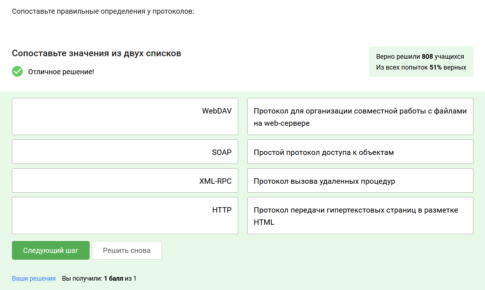{#fig:005 width=70%}

**Задание 5.** Отметьте самую распространённую версию протокола HTTP.

В курсе сказано, что протокол HTTP/1.1 является самым актуальным (рис. [-@fig:006]).

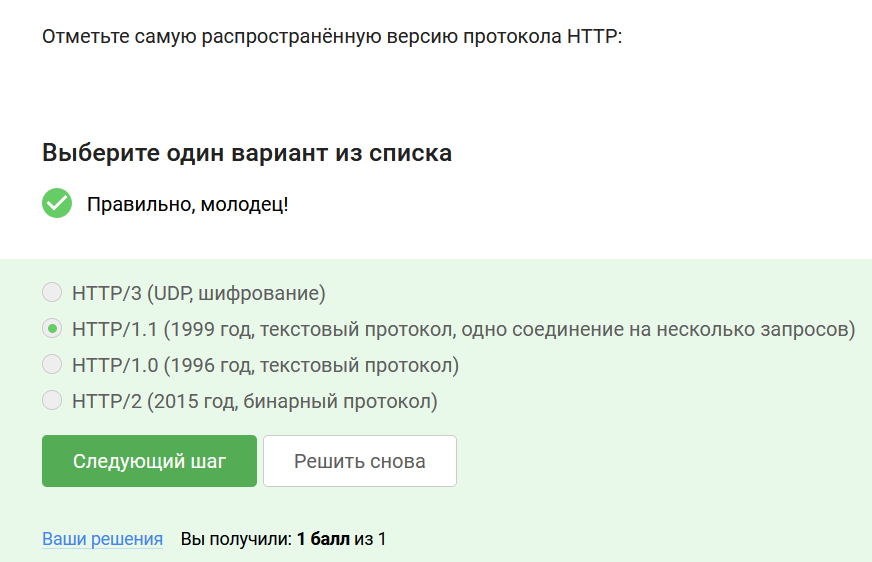{#fig:006 width=70%}

**Задание 6.** Поставьте правильные определения у методов запросов протокола HTTP/1.1.

В курсе приведены различные методы запросов с их описаниями, я брала информацию оттуда (рис. [-@fig:007]).

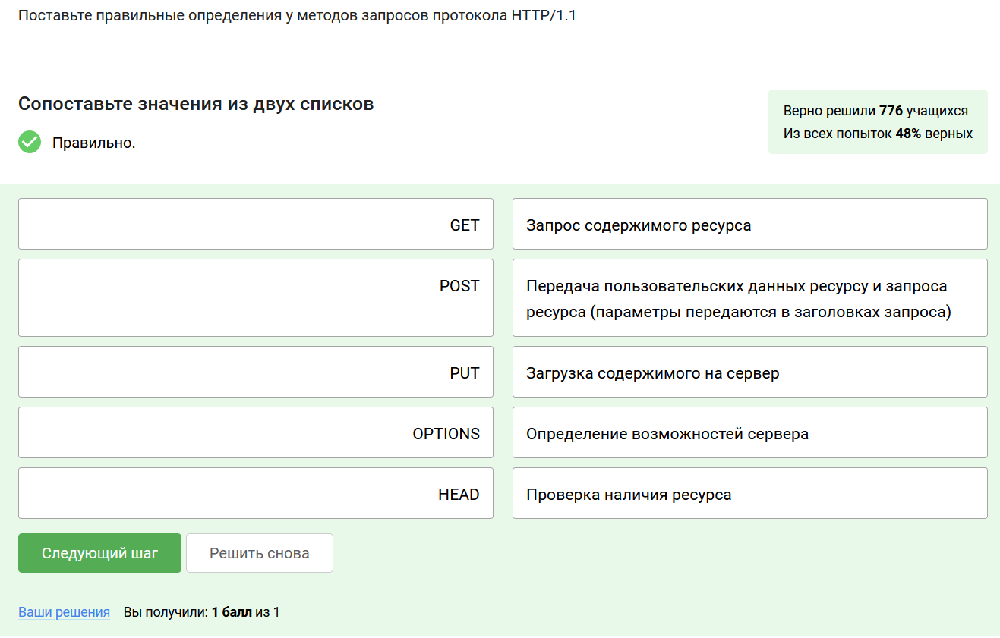{#fig:007 width=70%}

**Задание 7.** Сопоставьте коды ответов протокола HTTP/1.1 веб сервера и их определения.

Следующая после методов запросов идет информация о кодах ответов протокола, брала информацию оттуда (рис. [-@fig:008]).

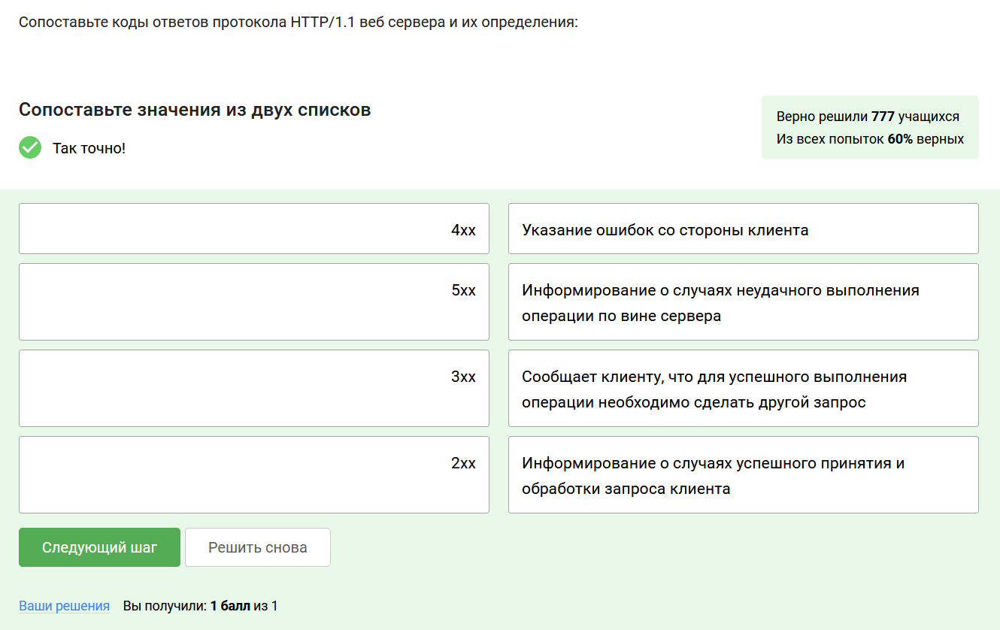{#fig:008 width=70%}

**Задание 8.** Определите, к каким описаниям протокола HTTP/1.1 относятся указанные фразы.

Это было сложное задание, в котором я опиралась на всю приведенную информацию из раздела 3.3 (рис. [-@fig:009]).

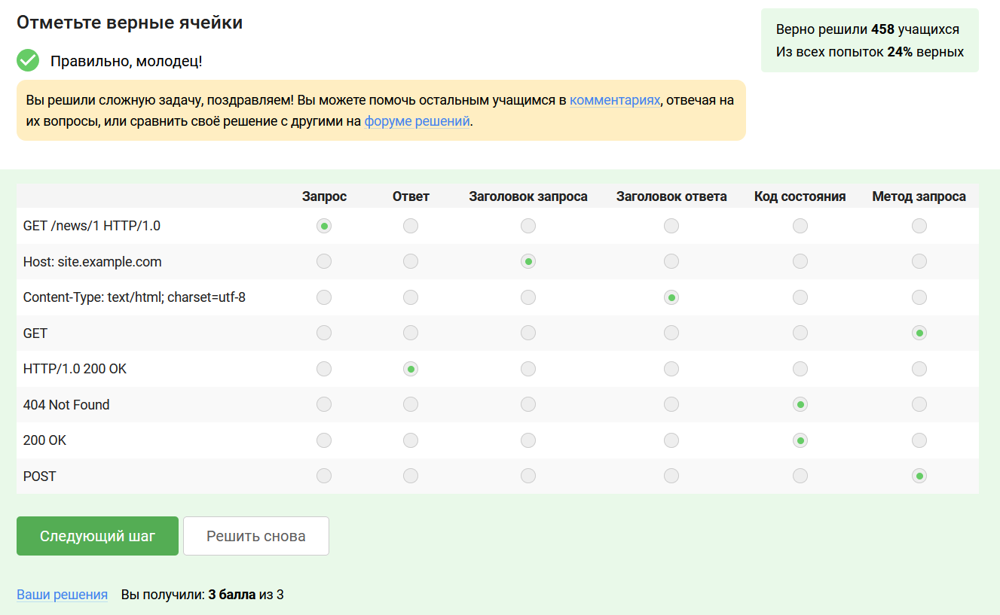{#fig:009 width=70%}

**Задание 9.** Выберите из перечисленного реализации Web-серверов.

Все три выбранных реализации Web-серверов приводятся в соответствующем теоретическом разделе (рис. [-@fig:010]).

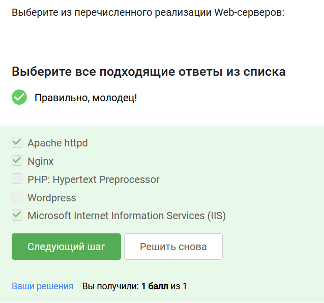{#fig:010 width=70%}

**Задание 10.** Укажите скриптовые языки и программные платформы, используемые для создания Web-серверов.

В задании представлены три из четырех предложенных в теоретическом разделе скриптовые языки и программные платформы, ещё также были указаны Python, Perl, Ruby on rails (рис. [-@fig:011]).

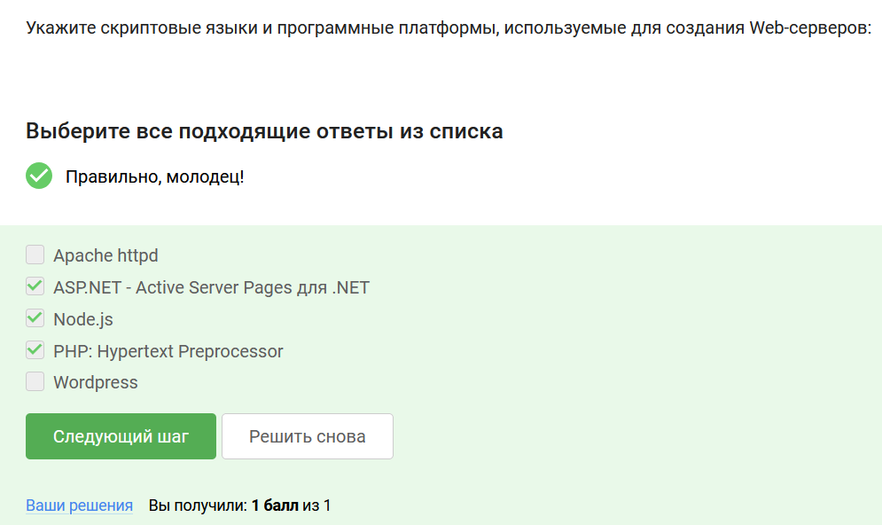{#fig:011 width=70%}

**Задание 11.** Какая система управления содержимым контентом (CMS-система) в настоящее время наиболее популярна?

Наиболее популярным и универсальным вариантом является WordPress, на котором возможно создать практически любой проект: от личного сайта до крупного портала или интернет-магазина (рис. [-@fig:012]).

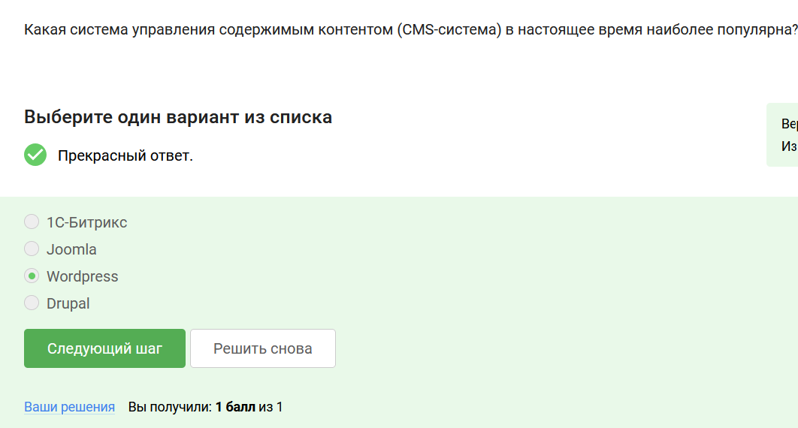{#fig:012 width=70%}

# Выводы

Я получила знания о работе веб-серверов.

