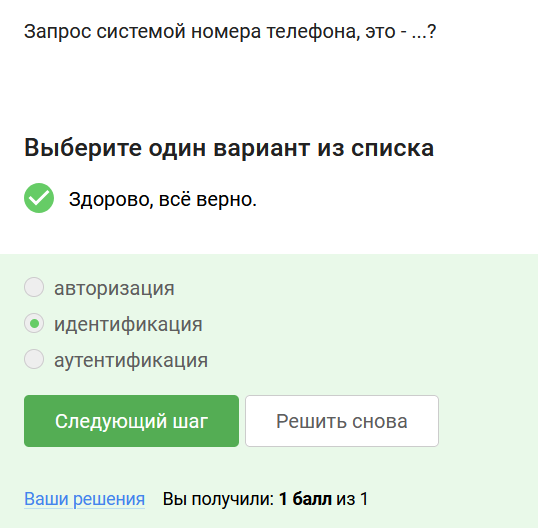
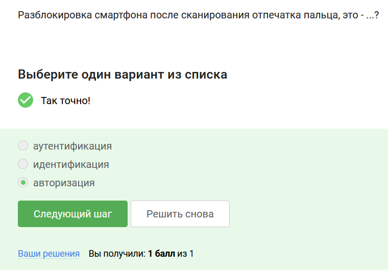
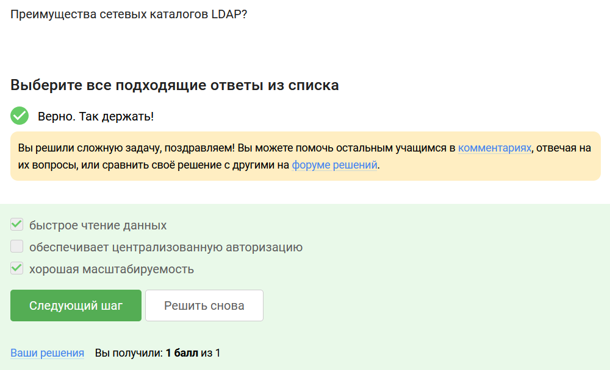
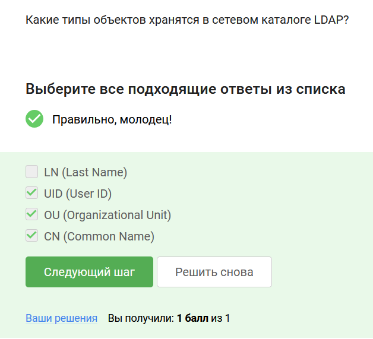
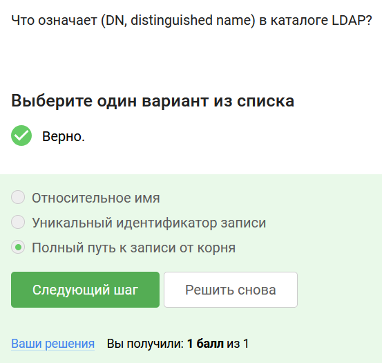
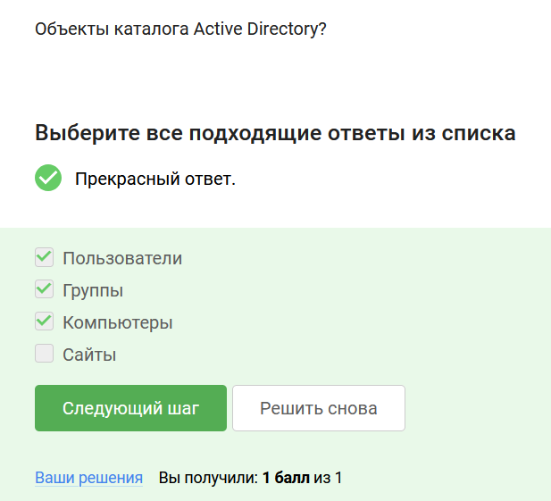
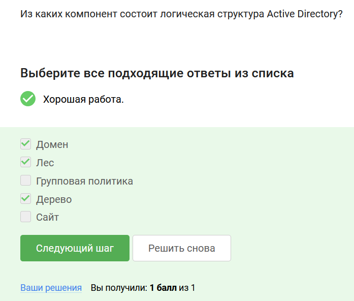
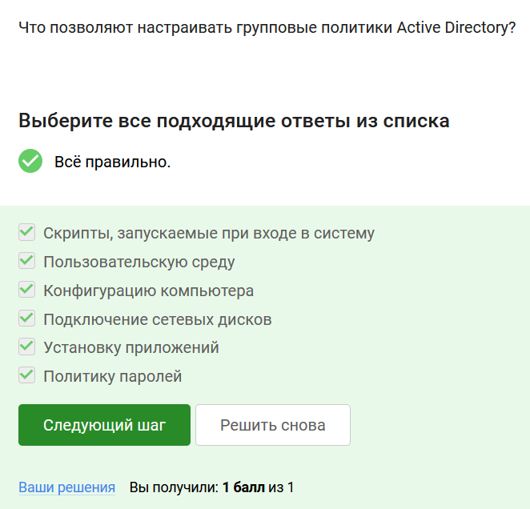
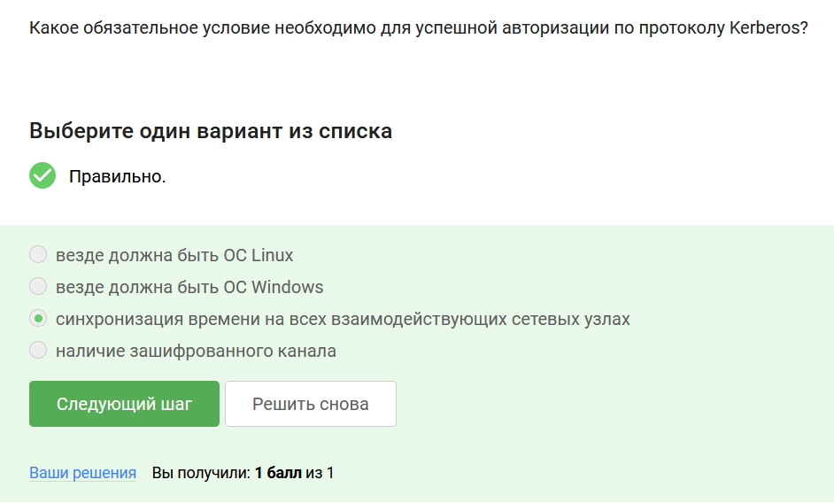
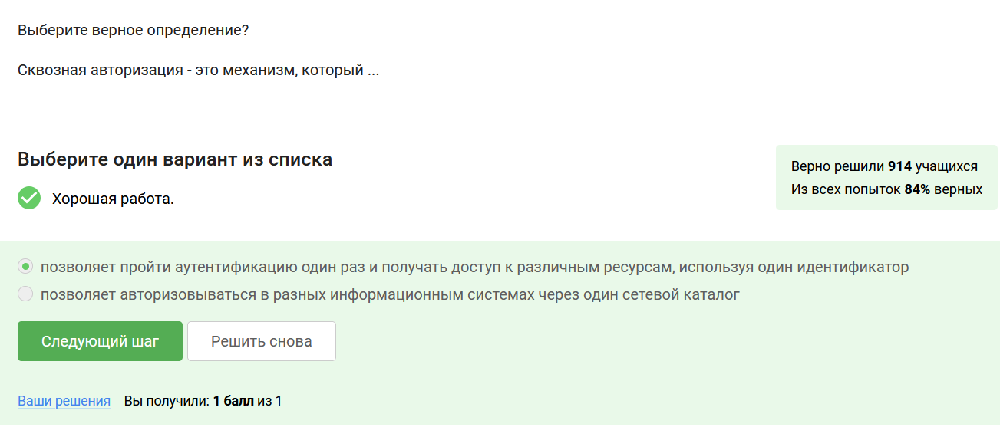

# Выполнение внешнего курса

**Задание 1.** Запрос системой номера телефона, это - ...?

В курсе подробно описано отличие идентификации, аутентификации и авторизации, в данном случае проверка телефона является процедурой распознавания субъекта по его идентификатору (рис. [-@fig:014]).

{#fig:014 width=70%}

**Задание 2.** Разблокировка смартфона после сканирования отпечатка пальца, это - ...?

Разблокировка телефона - это предоставление этому лицу возможностей в соответствие с положенными ему правами (рис. [-@fig:015]).

{#fig:015 width=70%}

**Задание 3.** Преимущества сетевых каталогов LDAP?

Для ответа на этот вопрос (рис. [-@fig:016]) нужна была следующая информация:

Сетевые каталоги:

- Хорошо масштабируются в силу своей иерархичности;
- Хорошо справляются с запросами на чтение в сравнении с запросами на запись.

{#fig:016 width=70%}

**Задание 4.** Какие типы объектов хранятся в сетевом каталоге LDAP?

В курсе приводится табличка со всеми типами объектов LDAP (рис. [-@fig:017]).

{#fig:017 width=70%}

**Задание 5.** Что означает (DN, distinguished name) в каталоге LDAP?

DN - это специальный атрибут каждого объекта, он включает полный путь к записи от корня DIT и этим напоминает путь к файлу в файловой системе (рис. [-@fig:018]).

{#fig:018 width=70%}

**Задание 6.** Объекты каталога Active Directory?
 
В тексте уроков упоминается, что объектом LDAP является и пользователь, и компьютер, и группы людей (рис. [-@fig:019]).

{#fig:019 width=70%}

**Задание 7.** Из каких компонент состоит логическая структура Active Directory?

Из домена, дерева и леса, как сказано в уроке (рис. [-@fig:020]).

{#fig:020 width=70%}

**Задание 8.** Что позволяют настраивать групповые политики Active Directory?

Настраивать можно широкий набор параметров — сценарии входа в систему и завершения сеанса работы в системе, параметры Рабочего стола и Панели управления, размещения личных папок пользователя, настройки безопасности системы (политики паролей, управления учетными записями, аудита доступа к сетевым ресурсам, управления сертификатами и т.д.), развертывания приложений и управления их жизненным циклом (рис. [-@fig:021]).

{#fig:021 width=70%}

**Задание 9.** Какоe обязательное условие необходимо для успешной авторизации по протоколу Kerberos?

Работая с протоколом Kerberos, необходимо, чтобы системные часы всех участвующих во взаимодействии узлов были синхронизированы (рис. [-@fig:022]).

{#fig:022 width=70%}

**Задание 10.** Выберите верное определение? Сквозная авторизация - это механизм, который ...

Это механизм, позволяющий пользователю пройти аутентификацию (вход со своими учетными данными) единовременно и получить доступ к различным программным продуктам, используя один идентификатор (рис. [-@fig:023]).

{#fig:023 width=70%}

# Выводы

Я получила знания о централизованной авторизации в сети.
