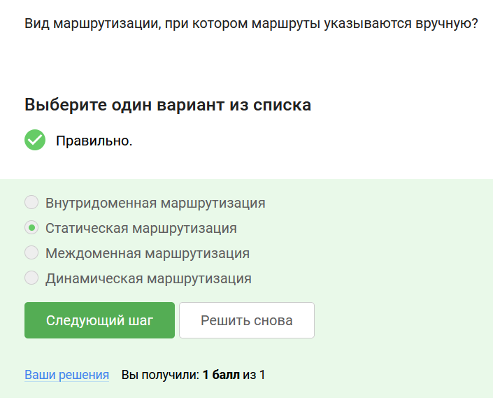
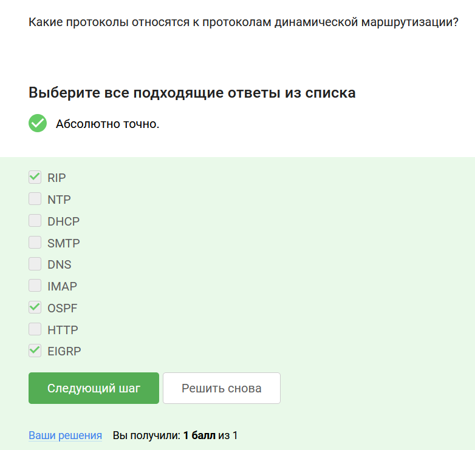
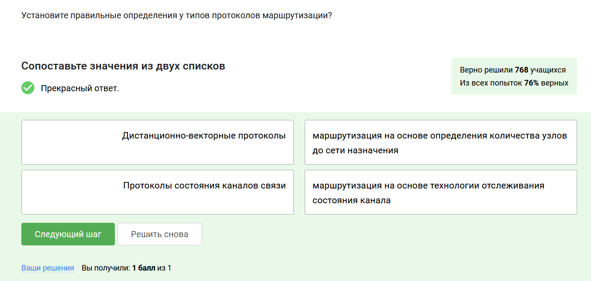
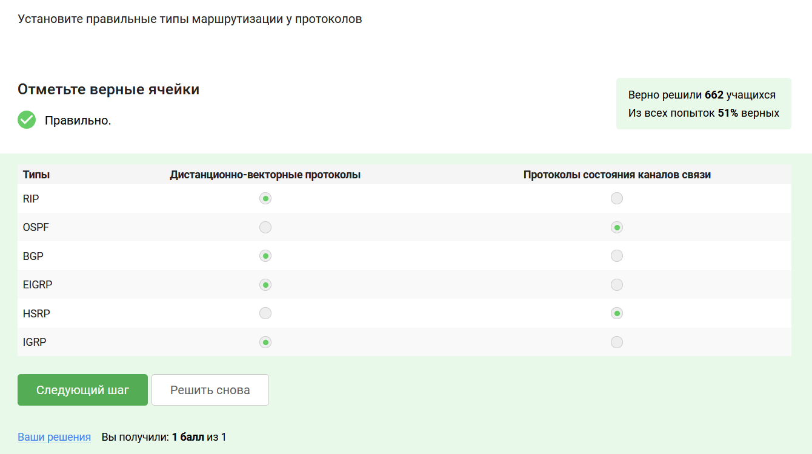
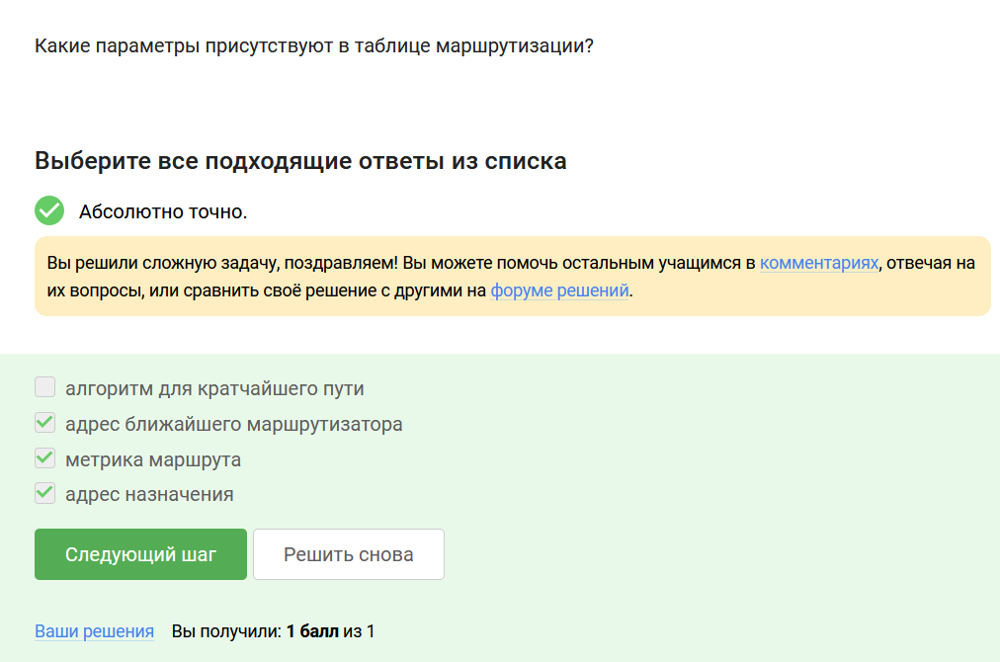

# Выполнение внешнего курса

**Задание 1.** Вид маршрутизации, при котором маршруты указываются вручную?

Статическая маршрутизация — вид маршрутизации, при котором маршруты указываются вручную при настройке маршрутизатора (рис. [-@fig:001]).

{#fig:001 width=70%}

**Задание 2.** Какие протоколы относятся к протоколам динамической маршрутизации?

Протоколы RIP, BGP, EIGRP, OSPF, HSRP (список приведен в курсе) (рис. [-@fig:002]).

{#fig:002 width=70%}

**Задание 3.** Установите правильные определения у типов протоколов маршрутизации?

Определения даны в курсе (рис. [-@fig:003]).

{#fig:003 width=70%}

**Задание 4.** Установите правильные типы маршрутизации у протоколов.

Дистанционно-векторные: RIP, BGP, EIGRP, IGRP. Протоколы состояния каналов связи: OSPF, HSRP (рис. [-@fig:004]).

{#fig:004 width=70%}

**Задание 5.** Какие параметры присутствуют в таблице маршрутизации?

Параметры даны в курсе (рис. [-@fig:005]).

{#fig:005 width=70%}

**Задание 6.** В каких устройствах есть таблица маршрутизации?

Во всех приведенных (рис. [-@fig:006]).

{#fig:006 width=70%}

# Выводы

Я получила знания о маршрутизации в локальных сетях.

