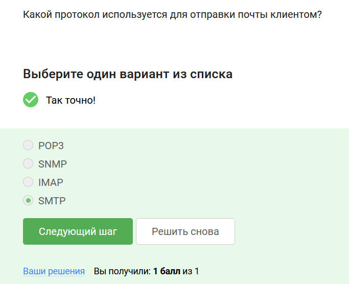
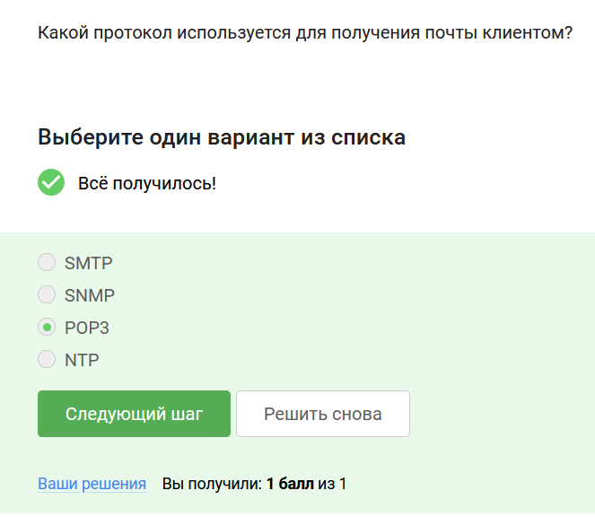
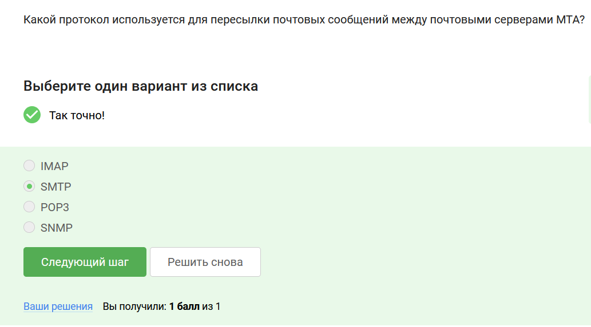
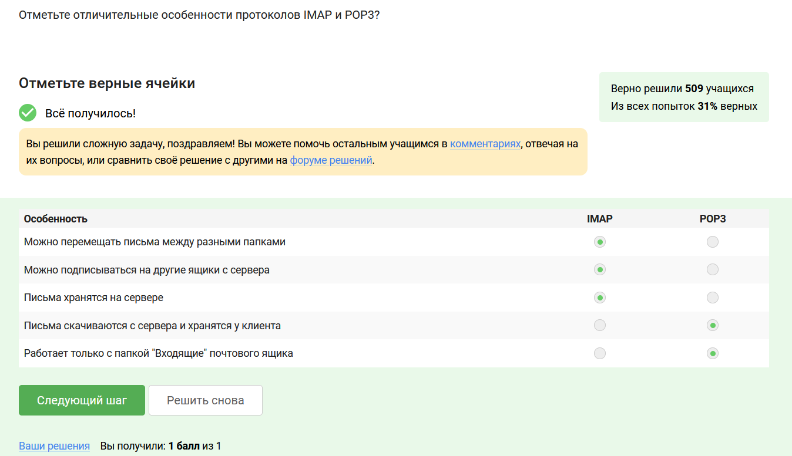

# Выполнение внешнего курса

**Задание 1.** Какой протокол используется для отправки почты клиентом?

SMTP (Simple Mail Transfer Protocol ) - протокол для отправки почтового сообщения серверу MTA, а также для пересылки сообщений между почтовыми серверами (MTA).

**Задание 2.** Какой протокол используется для получения почты клиентом?

POP3 (Post Office Protocol Version 3) - протокол для получения писем от почтового сервера MDA.

**Задание 3.** Какой протокол используется для пересылки почтовых сообщений между почтовыми серверами MTA?

SMTP (Simple Mail Transfer Protocol ) - протокол для отправки почтового сообщения серверу MTA, а также для пересылки сообщений между почтовыми серверами (MTA).

**Задание 4.** Отметьте отличительные особенности протоколов IMAP и POP3?

IMAP (Internet Message Access Protocol) - протокол для получения писем от почтового сервера MDA. Может работать с разными папками на сервере, с папками внутри ящика пользователя, так и с другими папками, к которым есть доступ, при этом письма остаются на сервере.

POP3 (Post Office Protocol Version 3) - протокол для получения писем от почтового сервера MDA. Работает только с ящиком пользователя целиком, забирает письма с сервера, но есть настройка оставлять письма на сервере.

# Выводы

Я получила знания о работе сервисов электронной почты.

